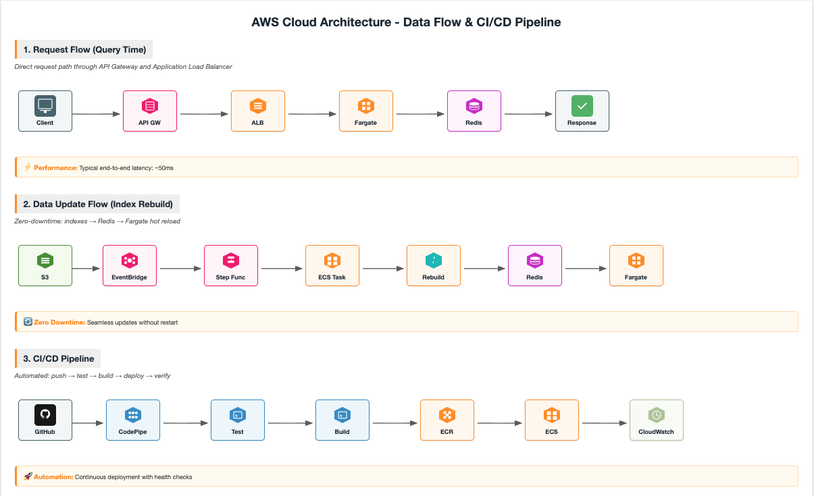

# Recipe Intelligence API

Python-based PoC for the Allrecipes Data Engineering case study.

## Features

- **Ingredient Co-occurrence** (Task 1) — Top N ingredients most frequently paired with a given ingredient
- **Recipe Duplicate Detection** (Task 2) — Find similar recipes using TF-IDF cosine similarity

## Quick Start

```bash
pip install -r requirements.txt

# Place dataset in data/ directory:
#   data/allrecipes.com_database_12042020000000.json
#   data/ingredient-list.json

uvicorn app.main:app --host 0.0.0.0 --port 8000
```

Swagger docs: [http://localhost:8000/docs](http://localhost:8000/docs)

## API

### GET `/api/ingredient-cooccurrence?ingredient=cinnamon`

Returns top 10 co-occurring ingredients.

### POST `/api/recipe-duplicates`

```json
{
  "recipe": {
    "name": "Cinnamon Bun Bread",
    "ingredients": [
      { "name": "all-purpose flour", "quantity": "3 cups" },
      { "name": "baking powder", "quantity": "1 tablespoon" }
    ]
  }
}
```

Returns top 5 similar recipes with similarity scores.

## AWS Architecture



## Stack

- **FastAPI** — async API framework with auto-generated docs
- **Pandas** — tabular data processing
- **scikit-learn** — TF-IDF vectorization + cosine similarity
- **uvicorn** — ASGI server

## Project Structure

```
recipe-intelligence/
├── app/
│   ├── main.py            # FastAPI app + endpoints
│   ├── models.py          # Pydantic request/response models
│   ├── data_loader.py     # Dataset loading + ingredient normalisation
│   └── services/
│       ├── cooccurrence.py  # Co-occurrence index
│       └── duplicates.py    # TF-IDF duplicate detection
├── data/                  # Dataset files (not committed)
├── requirements.txt
├── README.md
└── PRESENTATION.md        # Technical decisions & rationale
```
